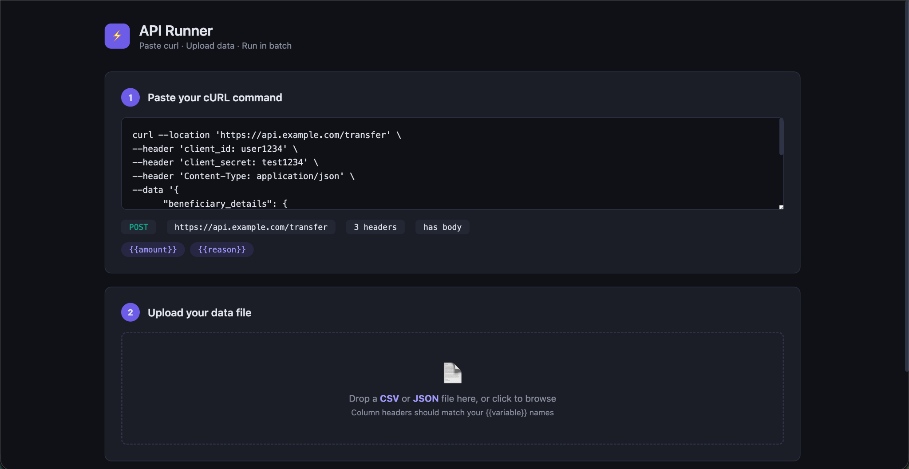
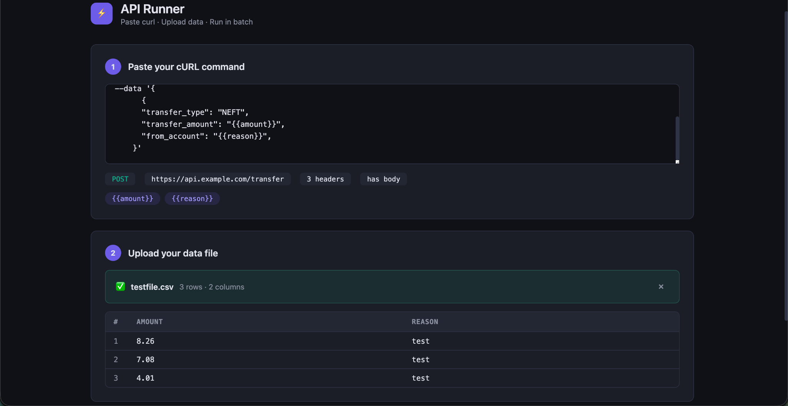
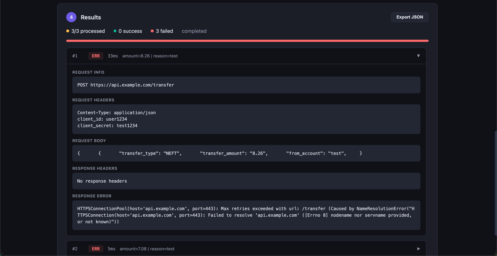

# ⚡ API Runner (Bulk cURL Executor)

Run bulk API requests using a single cURL + CSV/JSON file.

---

## 🚀 Features

- Paste full cURL (headers + body supported)
- Upload CSV / JSON data
- Variable substitution using {{variable}}
- Dry run preview before execution
- Batch execution with delay control
- Expandable results (request + response + headers)
- Export results as JSON

---

## 🛠 Setup

```bash
git clone https://github.com/okhardik/api-runner.git
cd api-runner
bash setup.sh
./start.sh
```

App runs at:
👉 http://localhost:5123

---

## 📥 Example cURL

```bash
curl --location 'https://api.example.com' \
--header 'Authorization: Bearer {{token}}' \
--header 'Content-Type: application/json' \
--data '{"amount": "{{amount}}"}'
```

---

## 📊 Example CSV

```
token,amount
abc123,100
xyz456,200
```

---

## 🧠 Use Cases

- Payment API testing
- Bulk request execution
- QA automation
- Internal tooling

---

## 📸 Screenshots

### 🧠 Smart cURL Parsing
Paste your cURL and the tool automatically detects method, headers, and variables.



---

### 📊 Upload Data & Preview
Upload CSV/JSON and instantly see parsed data mapped to variables.



---

### 🚀 Execution Results (Detailed)
View full request, headers, response, and errors in an expandable format.



## ⚠️ Notes

- Avoid running against production without safeguards
- Respect API rate limits

---

## 👨‍💻 Author

Built by Hardik ⚡
